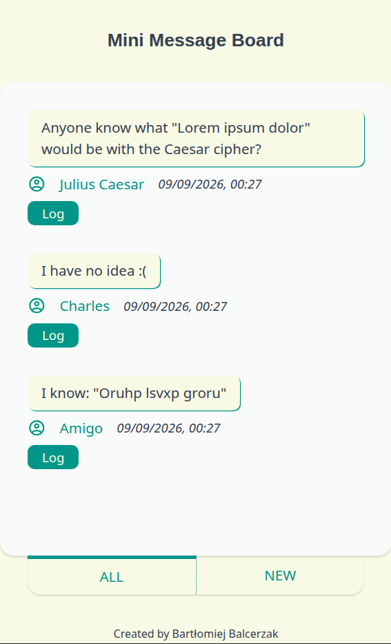
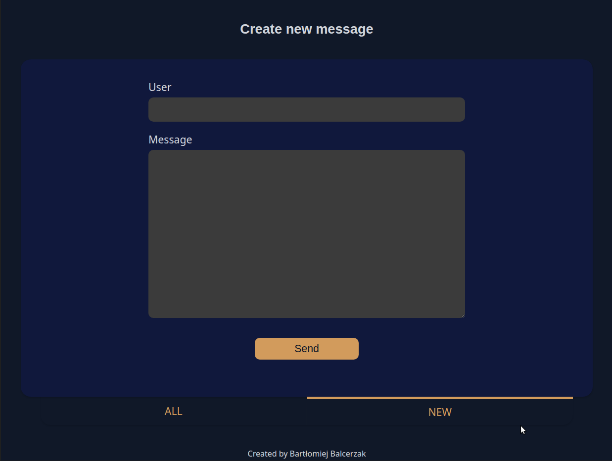

# The Odin Project > NodeJS Course > Project: Mini Message Board

## ☑️ [Project requirements](https://www.theodinproject.com/lessons/node-path-nodejs-mini-message-board)

## 🔴 [Live demo](https://mini-message-board-pgeu.onrender.com/)

## 🎯 Goal

- Create a basic messaging app using Express.js:
  - Use Express Router and controller architecture (MVC pattern)
  - Handle backend form submissions (`POST` requests & `express.urlencoded` middleware)
  - Implement custom error handling and middleware
- Render dynamic views using EJS:
  - Utilize templates and partials via the `include` directive

## ✨ Features

- **Message Board (`/`):** Display all posted messages (user, text, date added)
- **New Message Form (`/new`):** Submit a new message via `POST` request
- **Message Details:** Open a detailed view for each individual message
- **Error Page:** Render a custom 404 page for non-existent routes

## 📂 Project Structure

- `/controllers` - Logic for handling requests, rendering views, and managing message data
- `/routes` - Express routers mapping endpoints to controllers
- `/views` - EJS templates for the UI
- `app.js` - Server and middleware configuration

## ✂️ Screenshots

  
   
   
  

